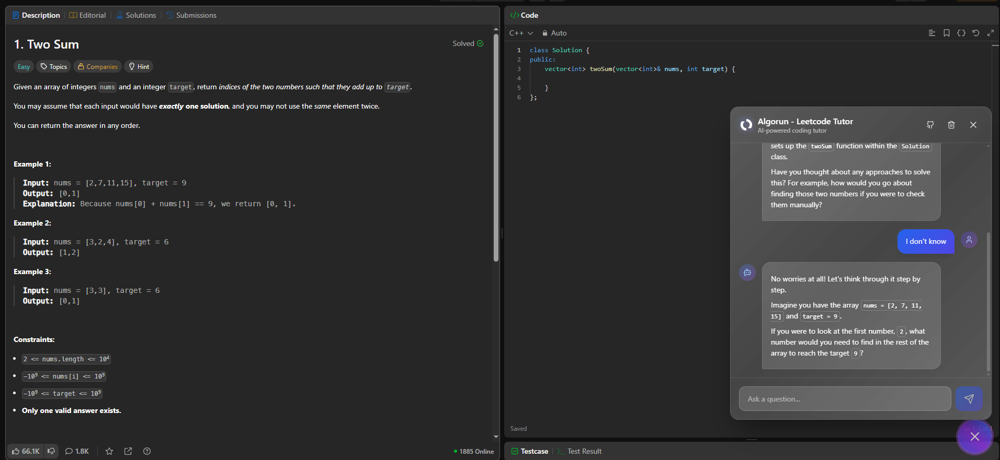

## Algorun – LeetCode Tutor (Chrome Extension)

AI-powered tutoring overlay for LeetCode. Get step-by-step solutions, explanations, and learning insights while you solve problems on `leetcode.com`. Built with React 19, TypeScript, Vite, and CRXJS.

<div align="center">
  
</div>

### Key Features

- **On-page tutor**: Floating chat opens on LeetCode problem pages (`https://leetcode.com/problems/*`).
- **Understands context**: Reads the page description and your current editor code to personalize help.
- **Gemini streaming**: Uses Google Gemini 2.5 Flash via `@ai-sdk/google` and `ai` for streamed responses.
- **Reasoning UI**: Shows a collapsible “reasoning” trace plus a clean final answer.
- **Session persistence**: Messages are saved in `sessionStorage` for the current tab.
- **Modern UI**: Vanilla CSS + `react-markdown` with code highlighting.

## Requirements

- Node.js 18+ (recommended)
- An encryption secret for securing user API keys

Create a `.env` file in the project root:

```bash
# .env
VITE_ENCRYPTION_SECRET=your_secret_here
```

Never commit your real API key. `.env` is read at build time by Vite.

## Quick Start

1. Clone the repository

```bash
# HTTPS
git clone https://github.com/lwshakib/algo-run-leetcode-tutor.git
cd algo-run-leetcode-tutor

# or SSH
# git clone git@github.com:lwshakib/algo-run-leetcode-tutor.git
# cd algo-run-leetcode-tutor
```

2. Install dependencies

```bash
npm install
```

3. Configure environment

```bash
echo VITE_ENCRYPTION_SECRET=your_secret_here > .env
```

4. Develop and load in Chrome

```bash
npm run dev
```

- In Chrome, open `chrome://extensions/`
- Enable Developer mode
- Click “Load unpacked” and select the `dist` folder
- Open any LeetCode problem page and click the chat button (bottom-right)

5. Build production

```bash
npm run build
```

This produces a production `dist/` and a distributable zip at `release/crx-<name>-<version>.zip`.

## How It Works

- `manifest.config.ts` defines the MV3 manifest using CRXJS. It injects `src/content/main.tsx` on `https://leetcode.com/problems/*` and exposes `logo.svg` as a web resource. The extension name/description come from `package.json`.
- `src/content/main.tsx` mounts the app container into the page.
- `src/content/views/App.tsx` renders the chat toggle button and passes the problem statement from the page’s `<meta name="description">`.
- `src/components/FloatingChatBox.tsx` streams responses from Gemini using `streamText`, with tools `google_search` and `url_context`. It builds a system prompt from `src/lib/prompt.ts` and collects:
  - Problem statement (page meta)
  - Current programming language (detected from the language switch button)
  - Your current code from the LeetCode editor (`.view-line` nodes via `extractCode` in `src/lib/utils.ts`)
- `src/lib/model.ts` initializes Google GenAI with the dynamic API key from storage and selects `gemini-2.5-flash-lite`.
- `src/hooks/useSessionStorage.tsx` debounces and saves messages to `sessionStorage`.
- `vite.config.ts` sets alias `@` → `src`, enables React, CRXJS, and emits a versioned release zip.

## Permissions & Matches

- **permissions**: `contentSettings`
- **content_scripts**: matches `https://leetcode.com/problems/*`
- **web_accessible_resources**: `logo.svg`

These are configured in `manifest.config.ts` and generated by CRXJS at build time.

## Scripts

- **dev**: Vite watch build for the extension
- **build**: Type-check + Vite production build
- **preview**: Vite static preview (useful for popup/sidepanel HTML testing)

```bash
npm run dev
npm run build
npm run preview
```

## Project Structure

- `src/content/` – Injected content UI for LeetCode pages
- `src/components/` – Chat UI, AI elements, and UI primitives
- `src/lib/` – Model setup, prompts, types, utilities
- `src/hooks/` – Custom hooks (session storage)
- `src/popup/` – Popup app (not injected by default in production)
- `src/sidepanel/` – Side panel app (optional)
- `manifest.config.ts` – MV3 manifest builder
- `public/` – Extension icons and assets

## Usage Tips

- Ensure you’re on a problem page. The chat button appears bottom-right.
- If responses are empty or not streaming, ensure you have set your Gemini API key in the extension popup and check the Chrome console for errors.
- If your code isn’t detected, make sure the LeetCode editor is visible. The extension scrapes `.view-line` elements.
- Page structure changes on LeetCode can break selectors. Update them in `FloatingChatBox.tsx` and `utils.ts` if needed.

## Development Notes

- The alias `@` points to `src` (see `vite.config.ts`).
- Streaming uses `ai` SDK’s `streamText`. Markdown is rendered via a hardened `react-markdown`.

## Roadmap / Limitations

- Currently scoped to LeetCode problem pages only.
- Depends on LeetCode DOM; minor upstream changes may require selector updates.
- No backend; everything runs in the browser with your API key.

## License

Add your preferred license here (e.g., MIT). If you include a `LICENSE` file, reference it here.
