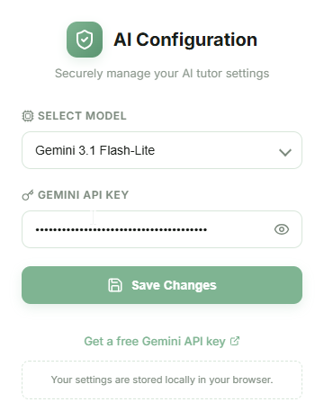
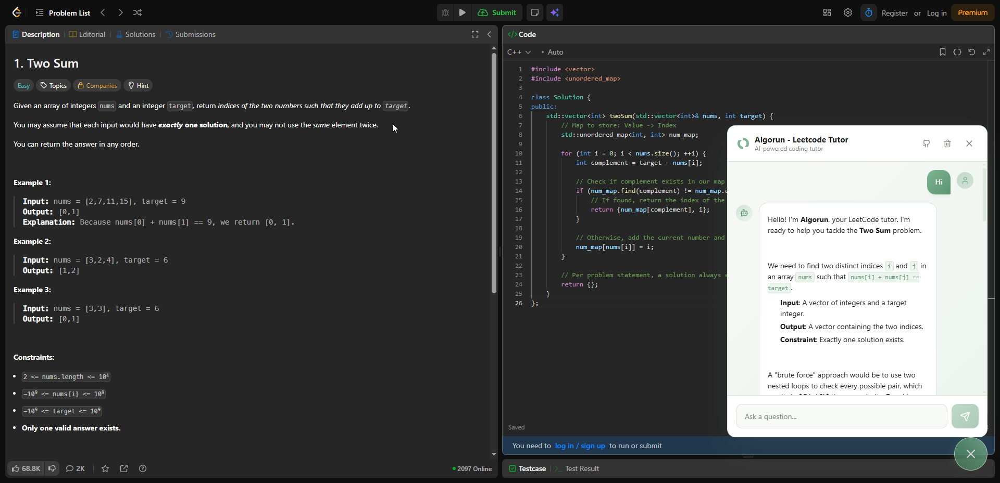
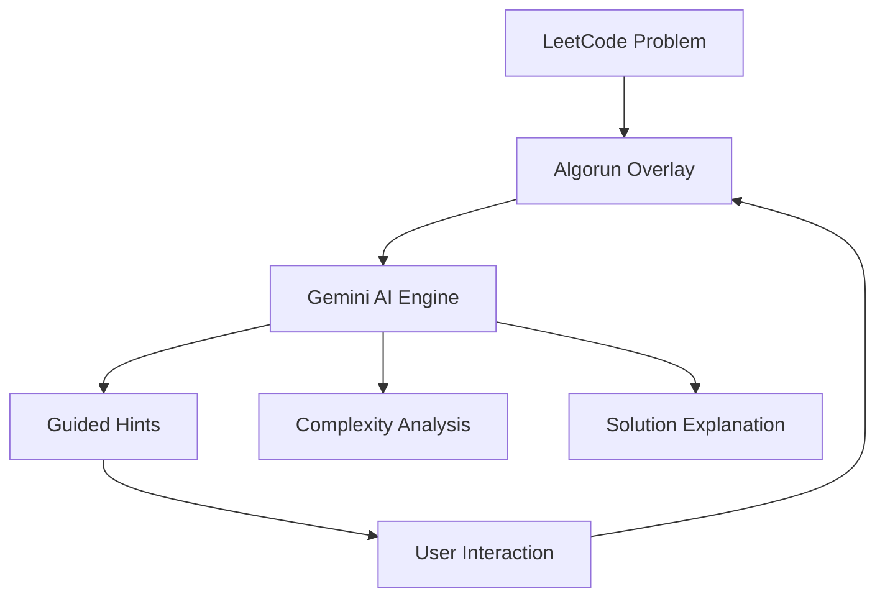

#  Algorun

**AI-powered tutoring overlay for LeetCode.** Get step-by-step solutions, explanations, and learning insights while you solve problems on `leetcode.com`.

<p align="center">
  
  
</p>

---

## 🧪 System Architecture


```mermaid
graph TD
    A[LeetCode Problem] --> B[Algorun Overlay]
    B --> C[Gemini AI Engine]
    C --> D[Guided Hints]
    C --> E[Complexity Analysis]
    C --> F[Solution Explanation]
    D --> G[User Interaction]
    G --> B
```

## 🚀 Key Features

- **Guided Hints**: Nudges you toward the answer without spoiling the solution.
- **Complexity Breakdown**: Instant Big-O analysis for time and space.
- **Pattern Recognition**: Learn the underlying algorithm patterns (Sliding Window, Two Pointers, DP).
- **Interactive Chat**: Ask questions and get real-time feedback on your code.

## 🛠️ Tech Stack

- **Monorepo**: [Turborepo](https://turbo.build/) + pnpm
- **Frontend**: [Next.js 15](https://nextjs.org/), [React 19](https://react.dev/), Tailwind CSS
- **Extension**: [CRXJS](https://crxjs.dev/) + [Vite](https://vitejs.dev/)
- **AI Engine**: [Gemini](https://deepmind.google/technologies/gemini/) (Google AI SDK) via [Vercel AI SDK](https://sdk.vercel.ai/)
- **UI System**: [shadcn/ui](https://ui.shadcn.com/) + Shared Component Library

## 🏁 Getting Started

### Prerequisites

- Node.js >= 20
- pnpm

### Setup

1. **Clone the repository:**
   ```bash
   git clone https://github.com/lwshakib/algo-run-leetcode-tutor.git
   cd algo-run-leetcode-tutor
   ```

2. **Install dependencies:**
   ```bash
   pnpm install
   ```

3. **Environment Setup:**
   You will need a Gemini API Key to use the tutor. Get one for free at [Google AI Studio](https://aistudio.google.com/app/apikey).

### Running Locally

- **Start development server:**
  ```bash
  pnpm dev
  ```

## 🤝 How to Contribute

We welcome contributions! Please see our [CONTRIBUTING.md](CONTRIBUTING.md) for detailed instructions on:
- Forking and cloning the repository.
- Setting up your development environment.
- Branching and pull request process.

## ⚖️ License

This project is licensed under the MIT License.
